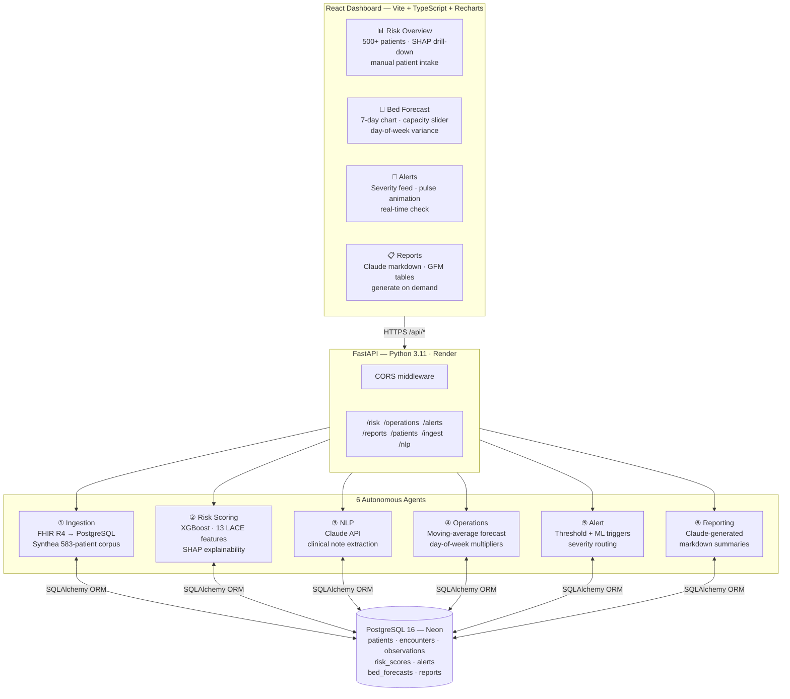

# HealthIQ — Clinical Intelligence Platform


**HealthIQ** is an end-to-end AI/ML healthcare analytics platform that turns raw FHIR R4 patient records into real-time clinical intelligence. Six autonomous agents ingest Synthea data, score 500+ patients for 30-day readmission risk using XGBoost with SHAP explanations, forecast 7-day bed demand, extract structured insights from clinical notes via Claude, fire threshold-based alerts, and generate natural-language population health reports — all surfaced in a mission-control React dashboard.

> Built across 10 daily development sprints to demonstrate the full AI/ML engineering stack: data ingestion → feature engineering → ML inference → LLM integration → REST API → interactive frontend → cloud deployment.

**Live demo:** [healthiq-six.vercel.app](https://healthiq-six.vercel.app) · **API docs:** [healthiq-m53h.onrender.com/docs](https://healthiq-m53h.onrender.com/docs)

> ⚠️ **Cold start:** The Render free tier spins the backend down after 15 min of inactivity. The first request may take 30–60 seconds — a warmup banner appears in the dashboard automatically.

---

## Architecture



---

## Key Features

| Agent | What it does |
|---|---|
| **Ingestion** | Parses Synthea FHIR R4 bundles or pulls from a live HAPI FHIR server; de-identifies PHI with SHA-256 hashing; idempotent re-runs |
| **Risk Scoring** | Builds a 13-feature matrix per patient (age, ER visits, LOS, lab values, comorbidities); trains XGBoost binary classifier on LACE-derived labels; writes SHAP explanations per patient |
| **NLP** | Sends clinical notes to Claude (`claude-sonnet-4-6`); extracts structured diagnoses, medications, and care gaps as JSON |
| **Operations** | 7-day bed demand forecast using moving-average of historical admissions with day-of-week multipliers (Mon/Tue +30%, weekend −25%) and deterministic per-day noise |
| **Alert** | Scans risk scores and bed forecasts against configurable thresholds; routes severity (`critical` / `urgent` / `warning`); skips duplicate active alerts |
| **Reporting** | Gathers a full data snapshot and calls Claude to write a natural-language population health report in markdown with GFM tables |

---

## Tech Stack

| Layer | Technology |
|---|---|
| **Language** | Python 3.11, TypeScript 5 |
| **API** | FastAPI 0.104 + Uvicorn |
| **ML** | XGBoost 2.1, scikit-learn, SHAP |
| **LLM** | Anthropic Claude (`claude-sonnet-4-6`) via LangChain |
| **ORM** | SQLAlchemy 2.0 |
| **Database** | PostgreSQL 16 (Neon serverless) |
| **Frontend** | React 18, Vite 6, TypeScript |
| **Charts** | Recharts |
| **Styling** | Tailwind CSS v4 (CSS-first `@theme`) |
| **Routing** | React Router v6 |
| **Markdown** | react-markdown + remark-gfm |
| **Testing** | pytest, httpx (201 tests) |
| **Containerisation** | Docker + Docker Compose |
| **Synthetic data** | Synthea (583 patients, 416K FHIR resources) |
| **Hosting** | Render (API) · Vercel (frontend) · Neon (DB) |

---

## Quickstart (local)

You need **Docker ≥ 24** and **Node 20+**.

```bash
git clone https://github.com/viraj5665/healthiq.git && cd healthiq
cp .env.example .env          # add your ANTHROPIC_API_KEY
docker compose up --build     # PostgreSQL + FastAPI on :8000
```

```bash
cd dashboard && npm install && npm run dev   # dashboard on :5173
```

Open **http://localhost:5173**. API docs at **http://localhost:8000/docs**.

### Seed the database

```bash
curl -X POST http://localhost:8000/ingest/synthea     # load 583 patients
curl -X POST http://localhost:8000/risk/score         # train XGBoost + SHAP
curl -X POST http://localhost:8000/operations/forecast
curl -X POST http://localhost:8000/alerts/check
```

### Run tests

```bash
pip install -r requirements.txt
pytest tests/ -v    # 201 tests
```

---

## API Reference

| Method | Endpoint | Description |
|---|---|---|
| `GET` | `/health` | Health check + DB latency |
| `POST` | `/ingest/synthea` | Ingest Synthea FHIR bundle directory |
| `POST` | `/ingest/run` | Ingest from live HAPI FHIR server |
| `POST` | `/risk/score` | Train XGBoost and score all patients |
| `GET` | `/risk/scores` | List scores with SHAP explanations |
| `POST` | `/operations/forecast` | Regenerate 7-day bed demand forecast |
| `GET` | `/operations/forecasts` | Retrieve current forecast |
| `POST` | `/alerts/check` | Run alert agent against current scores |
| `GET` | `/alerts` | List alerts (`?status=active&severity=critical`) |
| `POST` | `/reports/generate` | Generate Claude population health report |
| `GET` | `/reports/{id}` | Retrieve report with full markdown |
| `POST` | `/patients/manual` | Add patient + instant XGBoost score |
| `GET` | `/nlp/notes/{patient_id}` | Extract clinical insights via Claude |

Full interactive docs: **https://healthiq-m53h.onrender.com/docs**

---

## Project Structure

```
healthiq/
├── agents/
│   ├── ingestion/        # FHIR R4 parser + Synthea mapper
│   ├── risk_scoring/     # XGBoost features, model, SHAP
│   ├── nlp/              # Claude extractor + prompts
│   ├── operations/       # Bed forecaster
│   ├── alert/            # Threshold + ML alert engine
│   └── reporting/        # Data gatherer + Claude report writer
├── api/
│   ├── main.py           # FastAPI app + CORS
│   ├── models/           # SQLAlchemy ORM (10 tables)
│   └── routers/          # One router per domain
├── dashboard/            # React + Vite frontend
│   └── src/
│       ├── pages/        # RiskOverview, BedForecast, Alerts, Reports
│       ├── components/   # NavBar, StatCard, ScoreBar, ShapBar, ...
│       ├── lib/api.ts    # Typed fetch wrappers
│       └── types/        # Shared TypeScript interfaces
├── infra/migrations/     # Idempotent SQL migration files
├── scripts/migrate.py    # Runs on every Render deploy
├── tests/                # 201 pytest tests (unit + integration)
├── docker-compose.yml
├── Procfile              # Render start command
├── runtime.txt           # Python 3.11.9
└── .env.example
```

---

## Deployment

### Database → Neon

1. [neon.tech](https://neon.tech) → New Project → copy connection string

### Backend → Render

1. [render.com](https://render.com) → New Web Service → connect `viraj5665/healthiq`
2. **Build:** `pip install -r requirements.txt`
3. **Start:** `python scripts/migrate.py && uvicorn api.main:app --host 0.0.0.0 --port $PORT`
4. Add env vars: `DATABASE_URL`, `ANTHROPIC_API_KEY`, `CORS_ORIGINS` (Vercel URL), `APP_ENV=production`

### Frontend → Vercel

```bash
cd dashboard && vercel --prod
```

Set `VITE_API_BASE=https://your-render-service.onrender.com` in Vercel → Settings → Environment Variables, then redeploy.

---

## License

[MIT](LICENSE) © 2026 Viraj Patel
