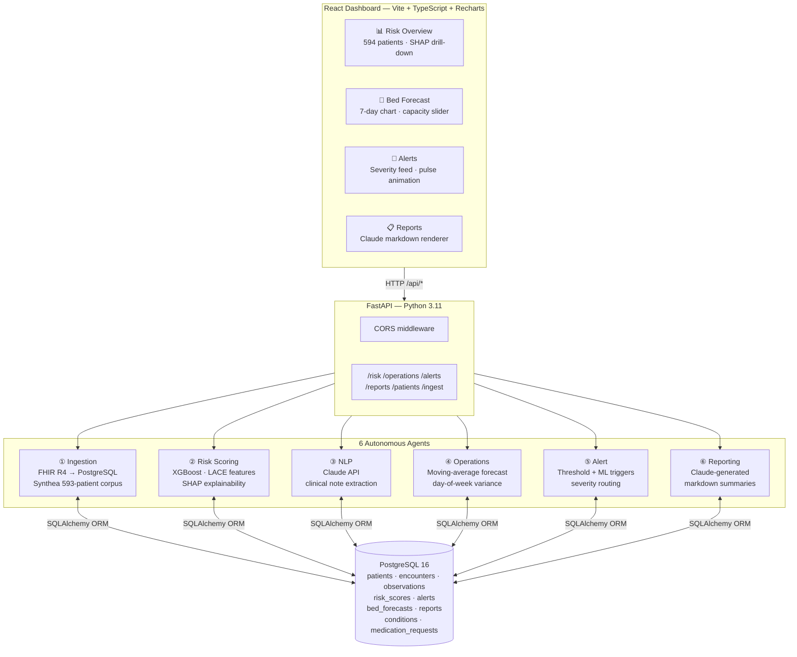

# HealthIQ — Clinical Intelligence Platform


**HealthIQ** is an AI-powered healthcare analytics platform that turns raw patient records into real-time clinical intelligence. Six autonomous agents continuously process FHIR R4 data — scoring readmission risk for every patient with XGBoost, forecasting bed demand for the next 7 days, surfacing clinical insights from notes using Claude, firing threshold-based alerts, and generating natural-language population health reports. Everything is wired to a mission-control React dashboard that a clinical team can act on without touching the underlying data.

> Built in 10 daily development sprints to demonstrate end-to-end AI/ML engineering: data ingestion → feature engineering → ML inference → LLM integration → REST API → interactive frontend.

---

## Screenshots

> *Add real screenshots here. Suggested shots: Risk Overview table with SHAP expansion, Bed Forecast chart with capacity slider, Alerts feed with pulsing critical dots, Reports page.*

| Risk Overview | Bed Forecast | Alerts |
|---|---|---|
| *(screenshot)* | *(screenshot)* | *(screenshot)* |

---

## Architecture



### How it works

1. **Ingestion Agent** parses Synthea FHIR R4 bundles (or a live FHIR server) and normalises Patients, Encounters, Observations, Conditions, and MedicationRequests into PostgreSQL.

2. **Risk Scoring Agent** builds a 13-feature matrix per patient (age, ER visits, length-of-stay, lab abnormalities, comorbidities) and trains an XGBoost binary classifier on LACE-derived labels. It writes each patient's readmission probability (0–1) and the top SHAP feature contributions back to the database.

3. **NLP Agent** sends clinical notes to Claude and extracts structured diagnoses, medication mentions, and potential care gaps as JSON.

4. **Operations Agent** computes a 7-day bed demand forecast using a moving average of historical admissions, then applies day-of-week multipliers (Mon/Tue +30%, weekend −25%) and per-day noise for realistic variance.

5. **Alert Agent** scans risk scores and bed forecasts against configurable thresholds and writes severity-tagged alerts (`critical` / `urgent` / `warning`) to the alerts table.

6. **Reporting Agent** calls Claude with a full data summary snapshot to produce a natural-language population health report in markdown, which is stored and rendered in the dashboard.

---

## Tech stack

| Layer | Technology |
|---|---|
| **Language** | Python 3.11, TypeScript 5 |
| **API framework** | FastAPI 0.115 + Uvicorn |
| **ML** | XGBoost 2.1, scikit-learn, SHAP |
| **LLM** | Anthropic Claude (claude-sonnet-4-6) via LangChain |
| **ORM** | SQLAlchemy 2.0 |
| **Database** | PostgreSQL 16 |
| **Frontend** | React 18, Vite 6, TypeScript |
| **Charts** | Recharts |
| **Styling** | Tailwind CSS v4 (CSS-first `@theme`) |
| **Routing** | React Router v6 |
| **Testing** | pytest, httpx |
| **Containerisation** | Docker + Docker Compose |
| **Synthetic data** | Synthea (593 patients, 416 K FHIR resources) |

---

## Quickstart

You need **Docker ≥ 24** and **Node 20+**. Three commands:

```bash
git clone https://github.com/viraj5665/healthiq.git && cd healthiq
cp .env.example .env          # add your ANTHROPIC_API_KEY
docker compose up --build     # starts PostgreSQL + FastAPI on :8000
```

Then in a second terminal:

```bash
cd dashboard && npm install && npm run dev   # dashboard on :5173
```

Open **http://localhost:5173** — the dashboard loads with live data.

> The API docs are at **http://localhost:8000/docs** (Swagger UI).

### Load the 593-patient dataset

After `docker compose up`, seed risk scores and alerts:

```bash
# Score all patients (trains XGBoost, writes SHAP explanations)
curl -X POST http://localhost:8000/risk/score

# Generate 7-day bed forecast
curl -X POST http://localhost:8000/operations/forecast

# Fire alert check
curl -X POST http://localhost:8000/alerts/check
```

### Run tests

```bash
pip install -r requirements.txt
pytest tests/ -v
# 201 tests, all green
```

---

## API reference

| Method | Endpoint | Description |
|---|---|---|
| `GET` | `/health` | Health check + DB latency |
| `POST` | `/ingest/synthea` | Ingest a Synthea FHIR bundle JSON |
| `POST` | `/risk/score` | Train XGBoost and score all patients |
| `GET` | `/risk/scores` | List risk scores with SHAP explanations |
| `POST` | `/operations/forecast` | Regenerate 7-day bed demand forecast |
| `GET` | `/operations/forecasts` | Retrieve current forecast |
| `POST` | `/alerts/check` | Run alert agent against current scores |
| `GET` | `/alerts` | List alerts (`?status=active&severity=critical`) |
| `POST` | `/reports/generate` | Generate Claude population health report |
| `GET` | `/reports` | List all generated reports |
| `GET` | `/reports/{id}` | Retrieve report with full markdown |
| `POST` | `/patients/manual` | Add patient + instant risk score |
| `GET` | `/nlp/notes/{patient_id}` | Extract clinical insights via Claude |

Full interactive docs: **http://localhost:8000/docs**

---

## Project structure

```
healthiq/
├── agents/                  # 6 autonomous AI agents
│   ├── ingestion/           # FHIR R4 parser + Synthea mapper
│   ├── risk_scoring/        # XGBoost features, model, SHAP
│   ├── nlp/                 # Claude extractor + prompts
│   ├── operations/          # Bed forecaster (pure functions)
│   ├── alert/               # Threshold + ML alert engine
│   └── reporting/           # Data gatherer + Claude report
├── api/
│   ├── main.py              # FastAPI app + CORS + routers
│   ├── config.py            # Pydantic settings (reads .env)
│   ├── database.py          # SQLAlchemy engine + session
│   ├── models/              # ORM models (10 tables)
│   └── routers/             # One router per domain
├── dashboard/               # React + Vite frontend
│   └── src/
│       ├── pages/           # RiskOverview, BedForecast, Alerts, Reports
│       ├── components/      # NavBar, StatCard, ScoreBar, ShapBar, ...
│       ├── lib/api.ts       # Typed fetch wrappers
│       └── types/index.ts   # Shared TypeScript interfaces
├── infra/
│   ├── docker/Dockerfile
│   └── migrations/          # Numbered SQL migration files
├── tests/
│   ├── unit/                # 8 test modules, 201 tests
│   └── integration/
├── docker-compose.yml
├── requirements.txt
└── .env.example
```

---

## Environment variables

Copy `.env.example` to `.env` and fill in:

| Variable | Required | Description |
|---|---|---|
| `DATABASE_URL` | ✅ | PostgreSQL connection string |
| `ANTHROPIC_API_KEY` | ✅ for NLP/Reports | Get one at console.anthropic.com |
| `APP_ENV` | — | `development` or `production` |
| `APP_SECRET_KEY` | — | Random string for production |
| `FHIR_SERVER_URL` | — | Live FHIR R4 base URL (optional) |

---

## Deployment

### Backend → Render

The repo includes a `render.yaml` blueprint. One-time setup:

1. Go to [render.com](https://render.com) → **New** → **Blueprint**
2. Connect the `viraj5665/healthiq` GitHub repo
3. Render detects `render.yaml` and creates:
   - `healthiq-api` — Python web service (FastAPI)
   - `healthiq-db` — PostgreSQL 16 (free tier)
4. After deploy, open the service → **Environment** → add:
   - `ANTHROPIC_API_KEY` = your key from console.anthropic.com
   - `CORS_ORIGINS` = your Vercel frontend URL (add after Vercel deploy)
5. Your API is live at `https://healthiq-api.onrender.com`

The `scripts/migrate.py` runs automatically on every deploy before Uvicorn starts, applying any new SQL migrations.

### Frontend → Vercel

```bash
cd dashboard
vercel                     # follow prompts, ~60 seconds
```

Then in the Vercel dashboard → **Settings** → **Environment Variables**:
- `VITE_API_BASE` = `https://healthiq-api.onrender.com`

Redeploy for the variable to take effect. The SPA rewrite rule in `vercel.json` handles React Router client-side routing.

> **Note:** Render's free-tier web services spin down after 15 min of inactivity. The first request after sleep takes ~30 s to cold-start. Upgrade to Starter ($7/mo) to keep it always-on.

---

## Contributing

See [CONTRIBUTING.md](CONTRIBUTING.md).

## License

[MIT](LICENSE) © 2026 Viraj Patel
